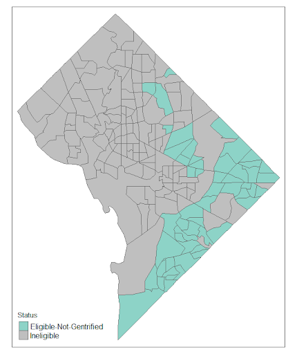
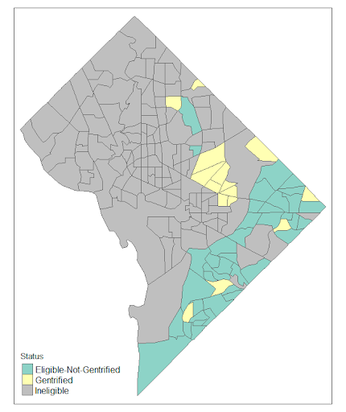

```{r setup, include=FALSE}
knitr::opts_chunk$set(echo = TRUE)
```

```{r message=FALSE, warning=FALSE, include=FALSE}
library(knitr)
library(tidyverse)
library(MatchIt)
library(Matching)
library(tidycensus)
library(tmap)
library(tmaptools)
library(janitor)
library(lubridate)
```

```{r message=FALSE, warning=FALSE, include=FALSE}
#reading in our data (can be found on github)
calls_2012_2019 <- read_csv("../Data/DC_311_Gentrified_Tracts_2012_2019_only.csv")

tracts_2012_2019 <- read_csv("../Data/Census_Data_2012_2019_Matched.csv")

#Creating Census Tract Variable
tracts_2012_2019 <- tracts_2012_2019 %>% separate(GEOID, into = c('STATECOUNTY', 'CENSUSTRACT'), 
                                                  sep = 5) %>%
  dplyr::select(CENSUSTRACT, matched) #selecting new column and tract for join

#Joining
DiD_Data <- calls_2012_2019 %>% full_join(tracts_2012_2019, by = "CENSUSTRACT") %>%
  dplyr::select(1:4, 42, 5:41) #arranging columns

#Filtering for general DiD Data
DiD_Data <- DiD_Data %>%
  filter(eligible == 1, #Only included matched data
         !is.na(RESOLUTIONDAYS), #filtering out NA's
         RESOLUTIONDAYS <= 31) #filtering for less than 31 days

#Selected Calls Vector
selected_calls <- c("Bulk Collection", "Trash Collection - Missed", "Parking Enforcement", "Pothole", "Sanitation Enforcement", "Illegal Dumping", "Residential Parking Permit Violation", "Streetlight Repair Investigation", "Tree Inspection", "Abandoned Vehicle - On Public Property", "Recycling Collection - Missed", "Alley Cleaning", "Graffiti Removal", "Street Cleaning")

DiD_Data <- DiD_Data %>% #filtering on selected calls
  filter(SERVICECODEDESCRIPTION %in% selected_calls) %>%
  dplyr::select(YEAR, eligible, gentrified, matched, SERVICECODEDESCRIPTION, ORGANIZATIONACRONYM, RESOLUTIONDAYS, ADDDATE, RESOLUTIONDATE)

DiD_Data <- DiD_Data %>%
  mutate(Treatment = gentrified,
         Post = case_when(YEAR == 2012 ~ 0,
                          YEAR == 2019 ~ 1),
         SERVICECODEDESCRIPTION = as.factor(SERVICECODEDESCRIPTION))
```

# Introduction

In this section, we introduce the reader to the phenomenon we investigate. We describe the way in which our analysis contributes to an important intellectual debate, or how it answers a pressing political or social question. We introduce our hypotheses, data, and results. We signpost for the reader what's coming in the rest of the paper.

# Background

Here we go deeper into the intellectual debate, the political and social context of our investigation. To give the reader a clear sense of why we are writing this paper, we describe the relevant scholarly, technical, or popular literature. We cite at least two published, peer-reviewed scholarly works. For example, we could cite @bhavsar2020 like this or like this [@bhavsar2020]. @bhavsar2020 provides a systematic review of defining gentrification for epidemiologic research. We only cite others' work in our paper when it enhances the reader's understanding of what we, the authors of this paper, are doing. We connect everything we cite to *our* investigation; this is our original research, not a book report or an annotated bibliography.

In order to integrate citations into the References section below, we use the \@ symbol (see bhavsar2020 above). This seems to work best in visual mode because it will pull up a drop down list of reference names from zotero (which must be open on your computer). Once you select the reference you want from the drop down menu it will ask you if you want to add it to the `reference.bib`. Then from there RMarkDown will auto populate all the references you cite while writing. We store `reference.bib` in the same folder as our paper's `.Rmd` and `.pdf` files. Its entries are formatted so that they can be knit to `.pdf`; see [https://j.mp/2UzTXEZ](https://www.overleaf.com/learn/latex/Bibliography_management_with_bibtex#The_bibliography_file) for example entries for articles, books, and miscellaneous. Zotero will generate these entries as long as the reference is in our group library or we can get these entries automatically from Google Scholar by turning on BibTeX in the Google Scholar Settings - Bibliography Manager.

# Data

\label{section:data}

This section describes the data we analyze. We describe the source of the data, and its primary features.

If our data were `cars`, loaded in the chunk above, we could note that our data have `r nrow(cars)` observations.

# Methods and Results

Here,  we describe the methods we use to answer our question and to test our hypotheses. We also explain and interpret our results. We try to learn as much as we can about our question as possible, given the data and analysis. We present our results clearly. We interpret them for the reader with precision and circumspection. We avoid making claims that are not substantiated by our data.


We can generate our plots with code or We can attach our plots like so: \newline 


{align=center, width=400}

{width=300}{width=300}

Note that this section may be integrated into Section \ref{section:data}, if joining the two improves the overall presentation.

Our results for the `cars` data include estimating the linear model  

$$\text{Distance}_i = \beta_0 + \beta_1 (\text{Speed}_i) + \epsilon_i.$$

Basic DiD Summary Table  \newline 

```{r echo=FALSE, message=FALSE, results='asis'}
basic_reg = lm(RESOLUTIONDAYS ~ Treatment + Post + Treatment*Post,  data = DiD_Data)
basic_reg_table <- xtable::xtable(basic_reg,
                             digits = 3,
                             caption = "Our Informative Caption",
                             float = F)
print(basic_reg_table, comment = FALSE)

```

DiD Controlling for call type summary table  \newline   

```{r echo=FALSE, message=FALSE, results='asis'}
control_reg = lm(RESOLUTIONDAYS ~ Treatment + Post + Treatment*Post + SERVICECODEDESCRIPTION,
                 data = DiD_Data)
control_reg_table <- xtable::xtable(control_reg,
                             digits = 3,
                             caption = "Our Informative Caption", 
                             float = F)
print(control_reg_table, comment = FALSE)
```

Basic DiD with Matching table  \newline 

```{r echo=FALSE, message=FALSE, results='asis'}
DiD_Data_Match <- DiD_Data %>%
  filter(matched == 1)

basic_match_reg = lm(RESOLUTIONDAYS ~ Treatment + Post + Treatment*Post,  DiD_Data_Match)
basic_match_reg_table <- xtable::xtable(basic_match_reg,
                             digits = 3,
                             caption = "Our Informative Caption")
print(basic_match_reg_table, comment = FALSE)
```

Matching DiD while controlling for call type  \newline  

```{r echo=FALSE, message=FALSE, results='asis'}
control_match_reg = lm(RESOLUTIONDAYS ~ Treatment + Post + Treatment*Post + SERVICECODEDESCRIPTION,
                       DiD_Data_Match)
control_match_reg_table <- xtable::xtable(control_match_reg,
                             digits = 3,
                             caption = "Our Informative Caption")
print(control_match_reg_table, comment = FALSE)
```

Matching DiD looking at Bulk Collection only   \newline 

```{r echo=FALSE, message=FALSE, results='asis'}
DiD_Data_Bulkmatch <- DiD_Data_Match %>%
  filter(SERVICECODEDESCRIPTION == "Bulk Collection")

#Running DiD regression
bulk_match_reg = lm(RESOLUTIONDAYS ~ Treatment + Post + Treatment*Post,  DiD_Data_Bulkmatch)

bulk_match_reg_table <- xtable::xtable(bulk_match_reg,
                             digits = 3,
                             caption = "Our Informative Caption")
print(bulk_match_reg_table, comment = FALSE)
```

Matching DiD looking at Parking Enforcement only   \newline 

```{r echo=FALSE, message=FALSE, results='asis'}
DiD_Data_Parkmatch <- DiD_Data_Match %>%
  filter(SERVICECODEDESCRIPTION == "Parking Enforcement")

#Running DiD regression
park_match_reg = lm(RESOLUTIONDAYS ~ Treatment + Post + Treatment*Post,  DiD_Data_Parkmatch)

park_match_reg_table <- xtable::xtable(park_match_reg,
                             digits = 3,
                             caption = "Our Informative Caption")
print(park_match_reg_table, comment = FALSE)
```

Below we show the model estimates. The table uses `stargazer()` as an alternative.  \newline 

```{r echo=FALSE, message=FALSE, results='asis'}
# We can print regression tables with xtable or stargazer:
stargazer::stargazer(basic_reg, 
                     title = "Our Informative Title",
                     dep.var.caption = "Outcome",
                     digits = 2,
                     header = FALSE)
```


# Discussion

We remind the reader what this paper was about, why it was important, and what we found. We reflect on limitations of the data or methods. If we have specific advice for someone picking up where we leave off, we provide that guidance. We avoid making trite statements like "more research should be done".

\newpage

# References
